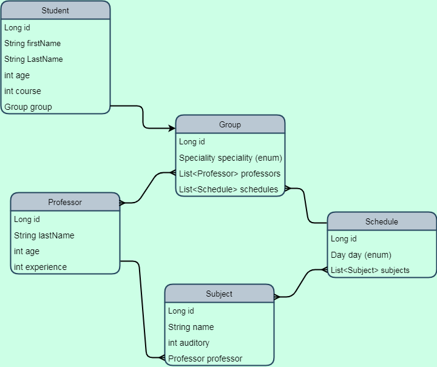

### University
***
#### About
REST 3 layer architecture style application that simulate the structure of a university and provides 
a class schedule for a specific student on a specific day.
***
#### Technologies used: 
* Java 11
* Spring Boot
* Hibernate
* Postgres SQL
* Mockito
* Lombok
***
#### Endpoints:
There is all CRUD operations for all entity, and one specific that show list of subjects depends on day
for student by id.
Instead of [classname] use one of these examples (students, groups, schedules, subjects, professors)
* POST http://localhost:8081/[classname] for creating 
* GET http://localhost:8081/[classname]/{id} for getting by id 
* GET http://localhost:8081/[classname] for getting all 
* PUT http://localhost:8081/[classname]/update/{id} for update 
* DELETE http://localhost:8081/[classname]/delete/{id} for delete
* GET http://localhost:8081/students/{id}?day={day} for schedule for specific student
***
#### Helpful point
For your comfort in program exist inject data controller with post construct method witch inject 
data after run app into a database and for start you have in db:
* 60 students (15 for each speciality, 5 for each course)
* 4 speciality (Economics, IT, History, Physics)
* 40 subjects (10 for all, 5 for Economics + History, 5 for IT + Physics, and 5 for each speciality)
* 15 professors(7 for all, 2 for Economics + History, 2 for IT + Physics, and 1 for each speciality)
* 20 relations between schedule and group 5 day education (saturday and sunday rest days)
***
#### How to run app: 
1. Clone from GitHub
2. Use docker-compose up -d to run app. 
3. Use mentioned above endpoints
#### UML diagram of relations between entities: 

